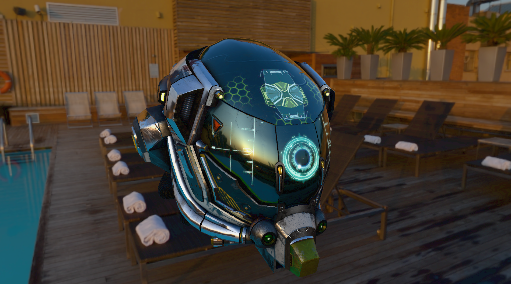
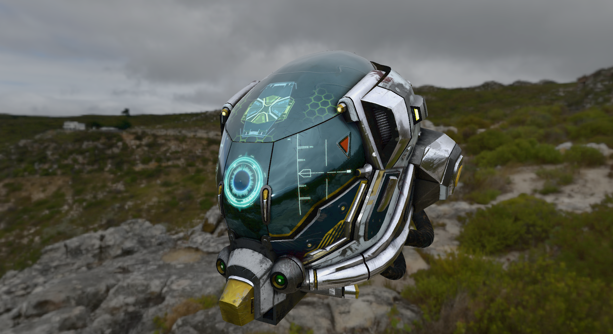

# Project_EX

**Project_EX** is a custom real-time renderer built with **C++ and OpenGL**, featuring a lightweight workflow and a modular engine architecture.

The project focuses on modern rendering techniques and a **Physically Based Rendering (PBR)** pipeline designed primarily for experimentation and learning.

---

## ✨ Overview

Project_EX implements a modern graphics pipeline with support for **forward rendering**.  
It emphasizes clean architecture, explicit resource management, and a custom asset pipeline suitable for engine-level development and renderer experimentation.

---

## 🔥 Features

-**Physically Based Rendering (PBR)**
-**Image-Based Lighting (IBL)** with GGX BRDF
-**HDR Rendering & Tone Mapping**
-**Forward Rendering Pipeline**
-**Custom Asset Loading Pipeline**

---

## 🛠 Technology Stack

- **Language:** C++
- **Graphics API:** OpenGL (Core Profile)
- **Math:** GLM
- **Assets:** glTF / OBJ (via custom pipeline)
- **Build System:** CMake
- **Platform:** Windows (currently)

---

## 🎥 Demo Video

📺 **YouTube Showcase**  
https://www.youtube.com/watch?v=8VYoi8kVgz4

This video demonstrates real-time PBR rendering, image-based lighting response and the overall renderer workflow.

---

## 🖼️ Screenshots





## ⬇️ Cloning the Repository

To clone the project **with all dependencies included**, use:

```bash
git clone --recurse-submodules https://github.com/ShanuPatel/Project_EX.git
```
If you already cloned without submodules:

```bash
git submodule update --init --recursive
```
## 🚧 Status
This project is actively developed and primarily intended for learning advanced rendering techniques, experimenting with engine architecture, and demonstrating real-time graphics concepts.

It is not intended to be a production-ready engine.

---

## 📚 Learning & Inspiration

This project is heavily inspired by educational resources and industry best practices, especially:

- **Yan Chernikov (The Cherno)**  
  For engine architecture patterns, rendering abstractions, and practical C++ workflows.

- **LearnOpenGL.com**  
  For foundational OpenGL concepts, PBR theory, and image-based lighting workflows.

Project_EX builds upon these ideas and extends them with a custom renderer structure and experimentation-focused workflow.

---

## 📦 Dependencies

Third-party libraries are managed through a dedicated **ExternalLibrary** module using **Git submodules**, keeping engine code clean and isolated.

> ⚠️ **Important:** This project uses Git submodules.

---

## 📜 License
This project is open-source and provided for educational purposes.
Third-party libraries are subject to their respective licenses.
This project is licensed under the MIT License.
